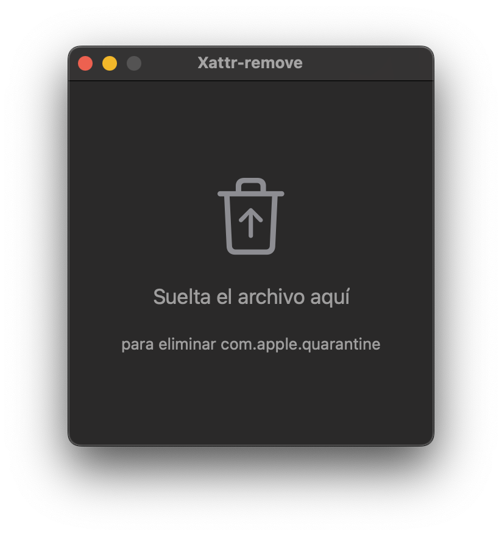
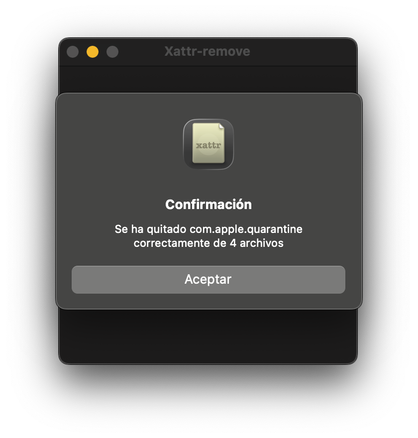
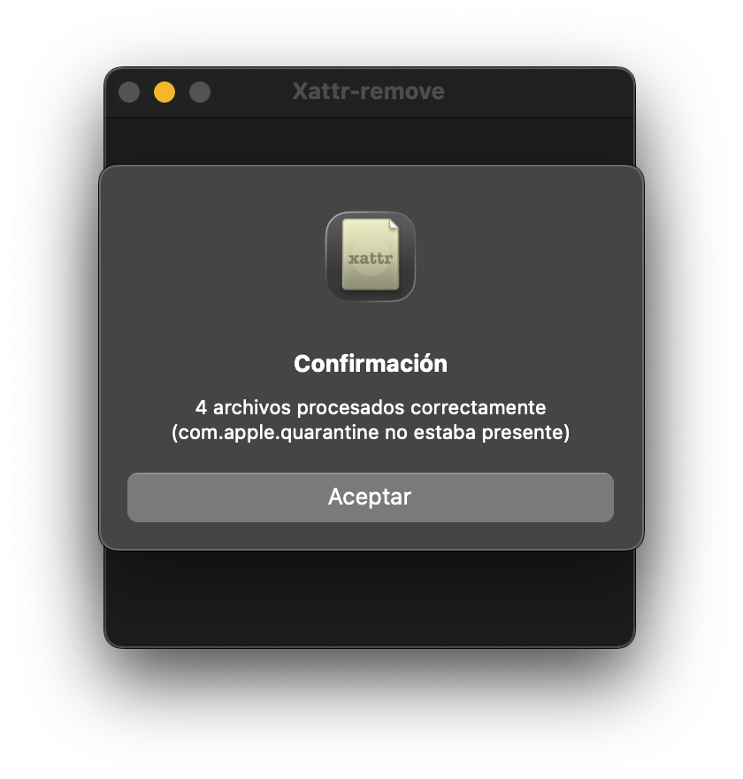
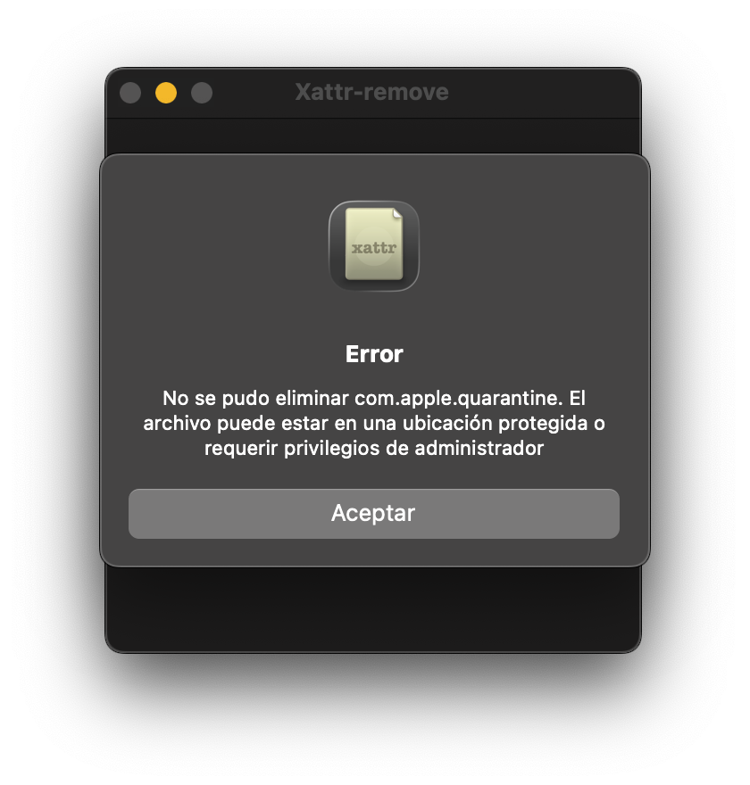

# Xattr-remove

  

Aplicación para macOS desarrollada con SwiftUI que elimina el atributo extendido `com.apple.quarantine` de los archivos descargados de internet. Funciona aceptando archivos mediante la función de arrastrar y soltar en la ventana de la aplicación.

Esta aplicación es una versión más sencilla y ligera de [Xattr Editor](https://github.com/perez987/Xattr-Editor). En lugar de mostrar y editar (eliminar, modificar y añadir) atributos extendidos, realiza una única tarea: eliminar `com.apple.quarantine` rápidamente de los archivos descargados de internet para que puedan abrirse en macOS sin advertencias de Gatekeeper.

| Capturas de pantalla |
|:----|
|  |
|  |
|  |
|  |
|  |

## Características

- Arrastra archivos a la ventana de la aplicación para eliminar el atributo de cuarentena
- Desarrollado con Swift y SwiftUI
- Gestiona errores (independientemente de si el atributo existe o no)
- Admite todo tipo de archivos, incluyendo aplicaciones y ejecutables
- Sistema de traducción con selector y 5 idiomas (alemán, inglés, francés, italiano y español)
- Elegir idioma: ir a `Idioma` > `Elegir idioma` en la barra de menús o usar el atajo de teclado `⌘ + L` 

## Compilación

Abre `Xattr-remove.xcodeproj` en Xcode y compila el proyecto. La aplicación requiere macOS 13.0 o posterior.

## Uso

1. Abre la aplicación para ver la ventana principal
2. Arrastra y suelta los archivos con el atributo de cuarentena en la ventana de la aplicación
3. El atributo de cuarentena (si existe) se elimina automáticamente
4. El usuario recibe una alerta como información
5. La aplicación se cierra automáticamente 3 segundos después de mostrar una alerta de confirmación
6. En caso de error, la aplicación se mantiene abierta sin cierre automático.

**Nota:** Los archivos deben soltarse en la ventana de la aplicación. No se permite soltar archivos en el icono de la aplicación en el Finder o el Dock debido a las restricciones de Gatekeeper con los ejecutables con atributo de cuarentena.

## Requisitos

- macOS 13.0 o posterior
- Xcode 14.0 o posterior.

## Primera ejecución

Xattr-remove, al ser una aplicación descargada de internet, también muestra la advertencia de Gatekeeper en la primera ejecución. Esto es inevitable, ya que la aplicación sólo está firmada ad hoc y no está notarizada. 
Para quitar el atributo la primera vez que ejecutas la app:

- abre Terminal
- escribe `sudo xattr -cr`
- arrastra Xattr-remove.app sobre la ventana de Terminal
- ENTER.

Esto no ocurre si descargas el código fuente, compilas la aplicación con Xcode y guardas el producto para uso habitual.

## Créditos

Basado en:

- https://github.com/rcsiko/xattr-editor
- https://github.com/perez987/Xattr-Editor
- https://github.com/jozefizso/swift-xattr
- https://github.com/overbuilt/foundation-xattr
- https://github.com/abra-code/XattrApp
