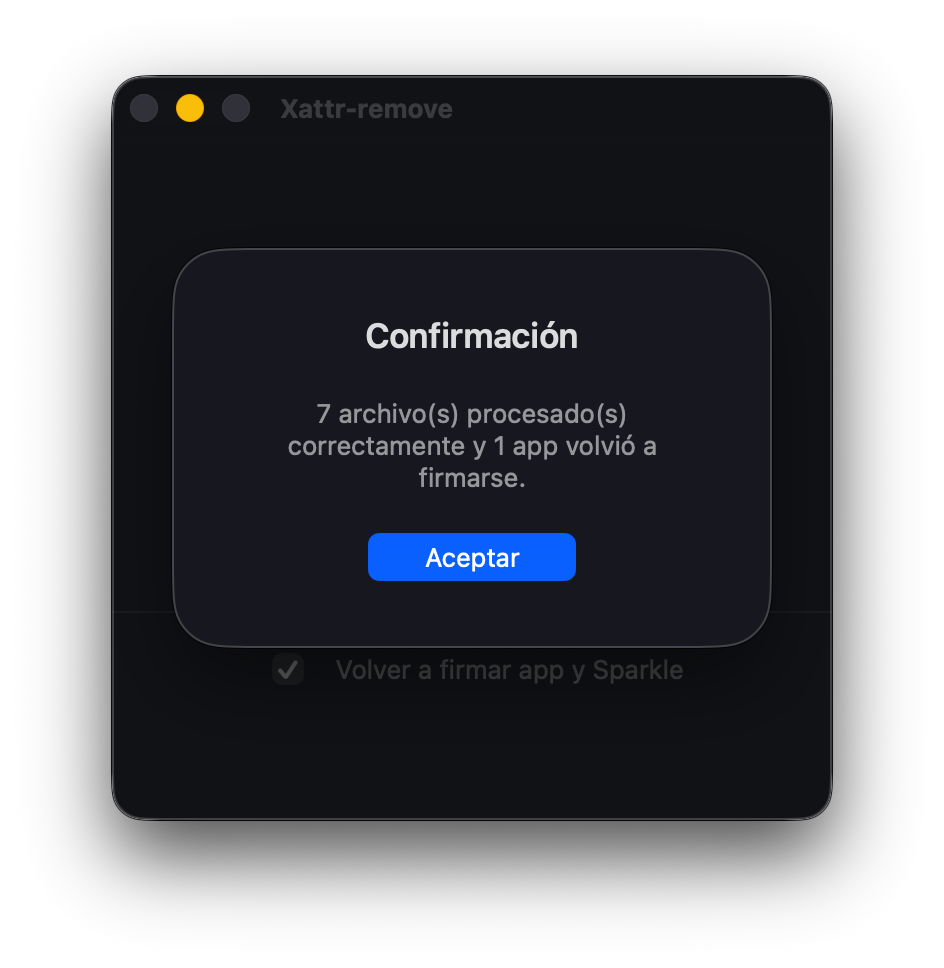
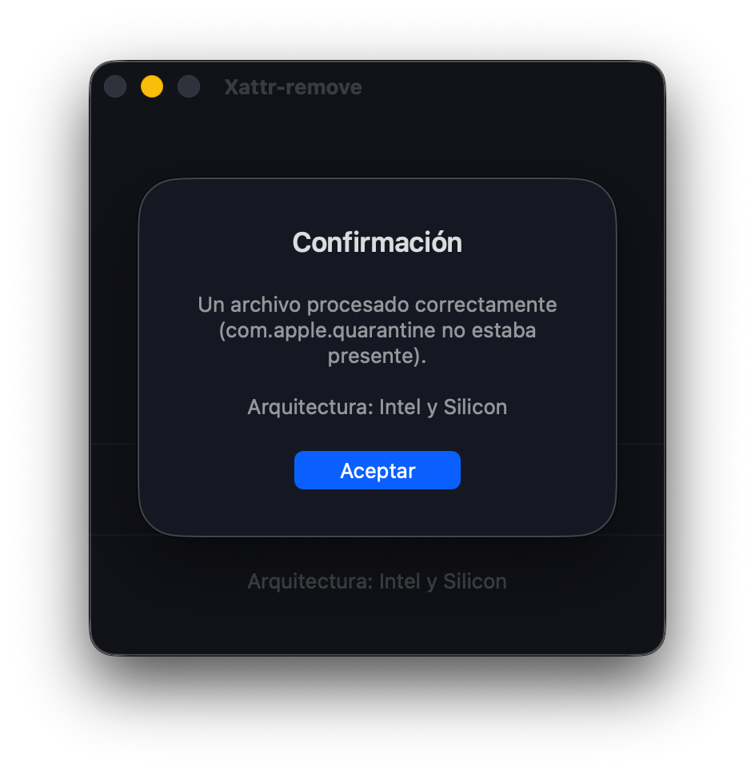

# Xattr-remove: quitar com.apple.quarantine y auto-firmar la aplicación (opcional)


<a href="README.md">
    
</a><br><br>

Aplicación para macOS desarrollada con SwiftUI que elimina el atributo extendido `com.apple.quarantine` de los archivos descargados de internet. Funciona aceptando archivos mediante la función de arrastrar y soltar en la ventana de la aplicación.

### Eliminar atributo de cuarentena

Esta aplicación es una versión más sencilla y ligera de [Xattr Editor](https://github.com/perez987/Xattr-Editor). En lugar de mostrar y editar (eliminar, modificar y añadir) atributos extendidos, realiza una única tarea: eliminar `com.apple.quarantine` rápidamente de los archivos descargados de internet para que puedan abrirse en macOS sin advertencias de Gatekeeper.

### Volver a firmar digitalmente (opcional)

Tamién puede, de manera opcional, auto firmar digitalmente *ad-hoc* una app (y el *framework* Sparkle) reemplazando su certificado. Esto es especialmente útil si al intentar ejecutar la app por primera vez, incluso si ya has quitado el atributo `com.apple.quarantine`, la app no arranca con un error relacionado con Sparkle. Esta opción equivale a ejecutar estos comandos:

```bash
 codesign --force --deep --sign - \
  <App-name>.app/Contents/Frameworks/Sparkle.framework

 codesign --force --deep --sign - \
  <App-name>.app
```

### Detección de la arquitectura

Si el archivo arrastrado a la ventana es un archivo .app, un ejecutable de macOS o una biblioteca, Xattr-remove ejecuta `lipo -archs` en el binario. El resultado se muestra en la ventana principal durante el procesamiento y se añade al mensaje de alerta de éxito. Puede ser `Intel y Silicon`, `Solamente Intel` o `Solamente Silicon`.

Para archivos múltiples, no se muestra información de arquitectura (sería ambiguo). Los archivos que no son binarios (documentos simples, scripts, etc.) no devuelven nada y no aparece esta información.

| Capturas de pantalla |
|:----|
|  |
|  |
|  |

## Características

- Arrastra archivos a la ventana de la aplicación para eliminar el atributo de cuarentena
- Casilla opcional para volver a firmar apps (primero Sparkle y después la app) tras el procesamiento del atributo `com.apple.quarantine`
- Información sobre arquitecturas detectadas si es un archivo binario de macOS
- Desarrollado con Swift y SwiftUI
- Gestiona errores (independientemente de si el atributo existe o no)
- Admite todo tipo de archivos, incluyendo aplicaciones y ejecutables
- Sistema de traducción con selector y 5 idiomas (alemán, inglés, francés, italiano y español)
- Elegir idioma: ir a `Idioma` > `Elegir idioma` en la barra de menús o usar el atajo de teclado `⌘ + L`

## Compilación

Abre `Xattr-remove.xcodeproj` en Xcode y compila el proyecto. La aplicación requiere macOS 13.0 o posterior.

## Uso

1. Abre la aplicación para ver la ventana principal
2. Arrastra y suelta los archivos descargados de Internet en la ventana de la aplicación
3. El atributo de cuarentena (si existe) se elimina automáticamente
4. (Opcional) Activa la casilla de "Volver a firmar" antes de soltar archivos para ejecutar `codesign` ad-hoc en `Sparkle.framework` y después en la app
5. El usuario recibe una alerta como información
6. La aplicación se cierra automáticamente 5 segundos después de mostrar una alerta de confirmación
7. En caso de error, la aplicación se mantiene abierta sin cierre automático.

**Nota:** Los archivos deben soltarse en la ventana de la aplicación. No se permite soltar archivos en el icono de la aplicación en el Finder o el Dock debido a las restricciones de Gatekeeper con los ejecutables con atributo de cuarentena.

## Requisitos

- macOS 13.0 o posterior
- Xcode 15.0 o posterior.

## Primera ejecución

Xattr-remove, al ser una aplicación descargada de internet, también muestra la advertencia de Gatekeeper en la primera ejecución. Esto es inevitable, ya que la aplicación sólo está firmada ad-hoc y no está notarizada.</br>
Para quitar el atributo la primera vez que ejecutas la app:

- abre Terminal
- escribe `sudo xattr -cr`
- arrastra Xattr-remove.app sobre la ventana de Terminal
- ENTER.

Esto no ocurre si descargas el código fuente, compilas la aplicación con Xcode y guardas el producto para uso habitual.

## Créditos

Basado en:

- https://github.com/rcsiko/xattr-editor
- https://github.com/perez987/Xattr-Editor
- https://github.com/jozefizso/swift-xattr
- https://github.com/overbuilt/foundation-xattr
- https://github.com/abra-code/XattrApp
