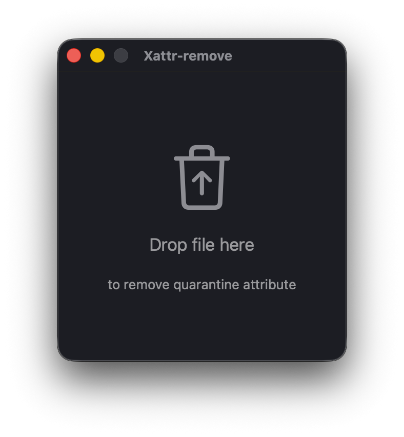
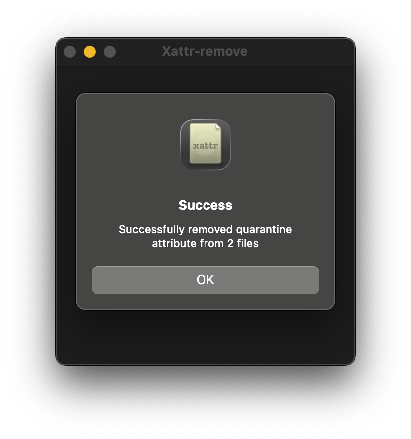
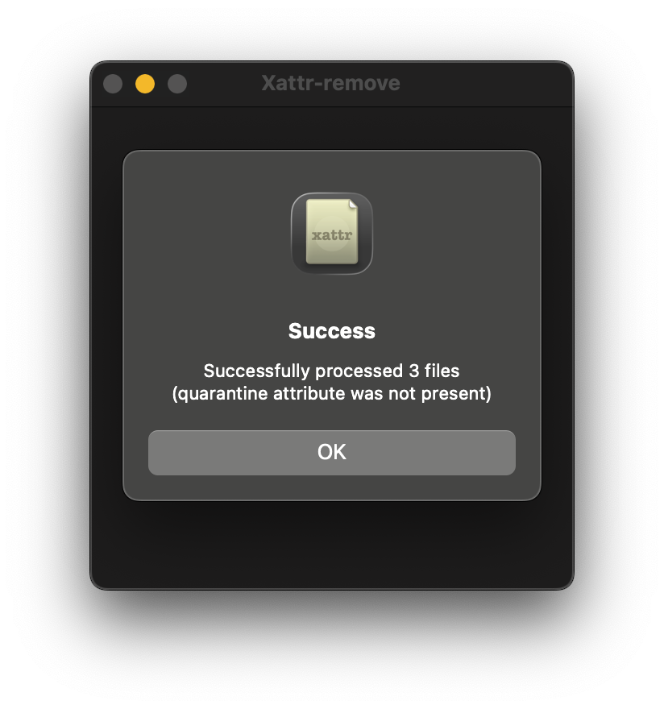
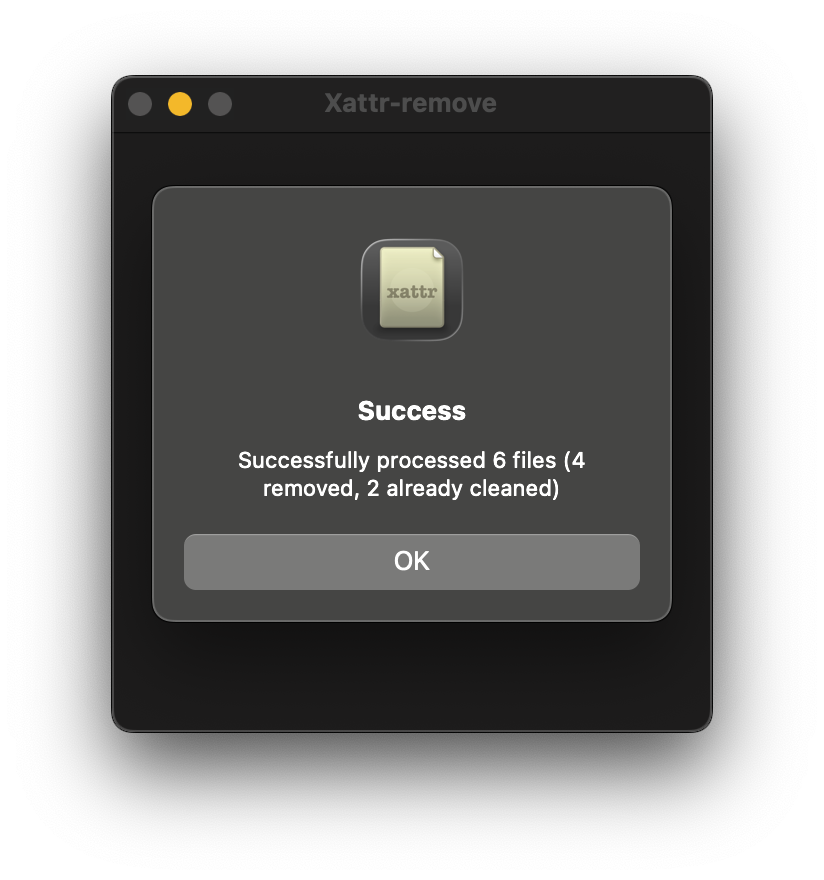
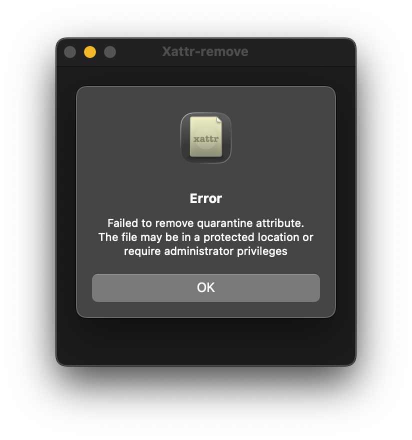

# Xattr-remove

  

SwiftUI application for macOS that removes `com.apple.quarantine` extended attribute from files downloaded from the Internet. Works by accepting files via drag and drop onto the app window.

This app is a simpler and lighter version of [Xattr Editor](https://github.com/perez987/Xattr-Editor). Instead of displaying and editing (removing, modifying, adding) extended attributes, it performs a single task: removing `com.apple.quarantine` in a quick way from files downloaded from the Internet so that they can be opened in macOS without Gatekeeper warnings.

| Screenshots |
|:----|
|  |
|  |
|  |
|  |
|  |

## Features

- Drop files onto the app window to remove the quarantine attribute
- Built with Swift and SwiftUI
- Handles errors (whether the attribute exists or not)
- Supports all file types including apps and executables
- Localization system with language selector and 5 languages (German, English, French, Italian and Spanish)
- Language selector: `Language` > `Select language` in menubar or `⌘ + L` keyboard shortcut 

## Building

Open `Xattr-remove.xcodeproj` in Xcode and build the project. The app requires macOS 13.0 or later.

## Usage

1. Launch the app to open the main window
2. Drag and drop files that have the quarantine attribute onto the app window
3. The quarantine attribute (if it exists) will be automatically removed
4. The user gets an alert as feedback
5. The app automatically quits 3 seconds after displaying a success alert

**Note:** Files must be dropped onto the app window. Dropping files onto the app icon in Finder or Dock is not supported due to macOS Gatekeeper restrictions with quarantined executables.

## Requirements

- macOS 13.0 or later
- Xcode 14.0 or later (for building)

## First run

Xattr-remove, since it's also an app downloaded from the Internet, it also displays the Gatekeeper warning on the first run. This is unavoidable since the app is only ad-hoc signed and not notarized.
 
To remove the quarantine attribute from Xattr-remove.app:

- open Terminal
- write `sudo xattr -cr`
- drag and drop Xattr-remove.app onto the Terminal window
- ENTER.

This doesn't happen if you download the source code, compile the app using Xcode, and save the product for regular use.

## Credits

Based on:

- https://github.com/rcsiko/xattr-editor
- https://github.com/perez987/Xattr-Editor
- https://github.com/jozefizso/swift-xattr
- https://github.com/overbuilt/foundation-xattr
- https://github.com/abra-code/XattrApp
