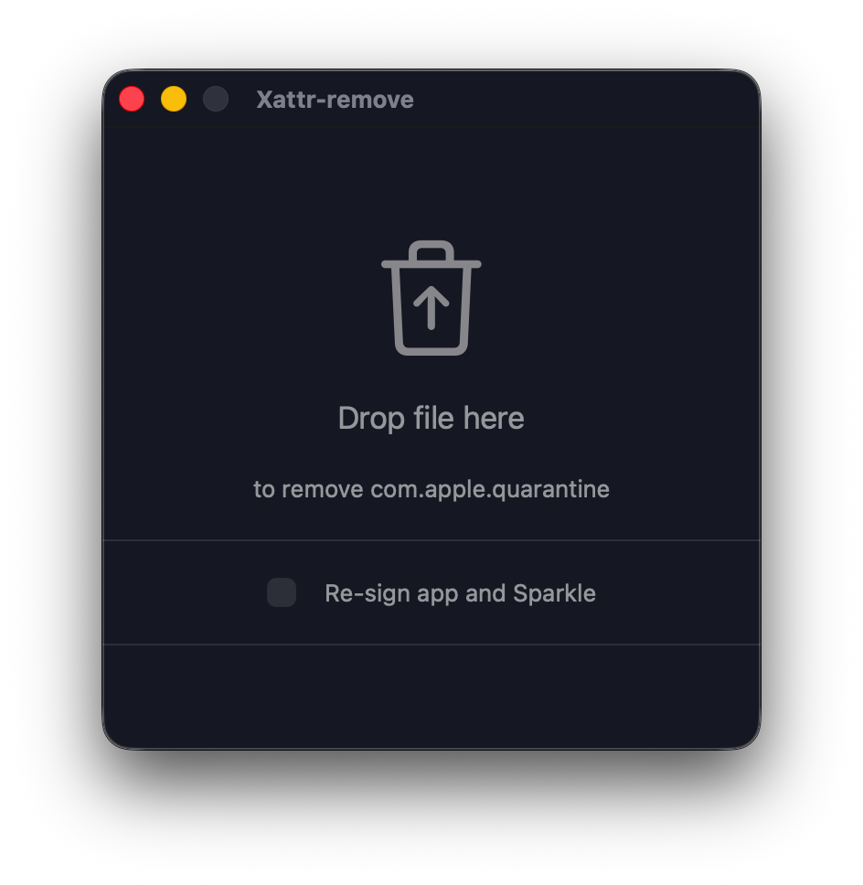
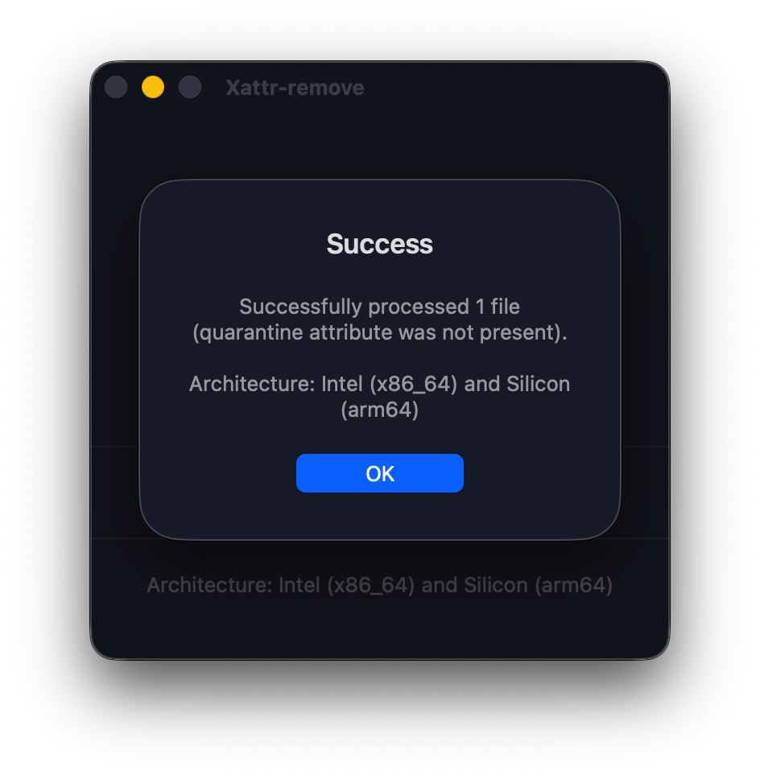
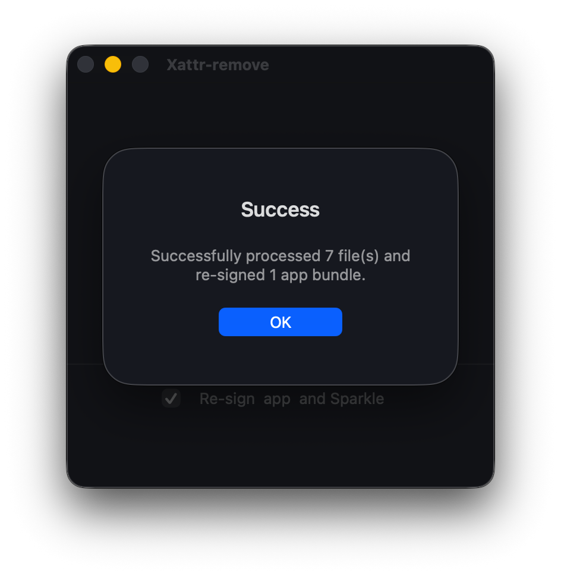

# Xattr-remove: clear com.apple.quarantine and re-sign app bundle (optional)


SwiftUI application for macOS that removes `com.apple.quarantine` extended attribute from files downloaded from the Internet. Works by accepting files via drag and drop onto the app window.

### Quarantine attribute removal

This app is a simpler and lighter version of [Xattr Editor](https://github.com/perez987/Xattr-Editor). Instead of displaying and editing (removing, modifying, adding) extended attributes, it performs a single task: removing `com.apple.quarantine` in a quick way from files downloaded from the Internet so that they can be opened in macOS without Gatekeeper warnings.

### Digital re-sign (optional)

You can also optionally digitally self-sign *ad-hoc* an app (and the Sparkle framework) by replacing its certificate.
This is especially useful if, trying to run an app for the first time, even after removing the `com.apple.quarantine` attribute, the app crashes with a Sparkle-related error.
This option is equivalent to running these commands:

```bash
 codesign --force --deep --sign - \
  <App-name>.app/Contents/Frameworks/Sparkle.framework

 codesign --force --deep --sign - \
  <App-name>.app
```

### Architecture detection

If the file dragged onto the window is an .app, a macOS executable or a library, Xattr-remove runs `lipo -archs` on the binary. The result (architecture/s of the file) is shown in the main window while processing, and appended to the success alert message. It can be `Intel and Silicon`, `Only Intel` or `Only Silicon`. For multiple-file drops, no architecture info is shown (it would be ambiguous). Non-binary files (plain documents, scripts, etc.) silently return nothing and no label appears.

| Screenshots |
|:----|
|  |
|  |
|  |
|  |

## Features

- Xattr-remove is certified by Apple and has no issues with Gatekeeper on first run
- Drop files onto the app window to remove the quarantine attribute
- Optional checkbox to re-sign app bundles (Sparkle first, app second) after removing the `quarantine` attribute
- Information about detected architectures if it is a macOS binary file
- Built with Swift and SwiftUI
- Handle errors (whether the attribute exists or not)
- Supports all file types including apps and executables
- Localization system with language selector and 5 languages (German, English, French, Italian and Spanish)
- Language selector: `Language` > `Select language` in menubar or `⌘ + L` keyboard shortcut 

## Building

Open `Xattr-remove.xcodeproj` in Xcode and build the project. The app requires macOS 13.0 or later.

## Usage

1. Launch the app to open the main window
2. Drag and drop files downloaded from Internet onto the app window
3. The quarantine attribute (if it exists) will be automatically removed
4. (Optional) Enable the re-sign checkbox before dropping files to run ad-hoc `codesign` on `Sparkle.framework` and then the app bundle
5. The user gets an alert as feedback
6. The app automatically quits 5 seconds after displaying a success alert

**Note:** Files must be dropped onto the app window. Dropping files onto the app icon in Finder or Dock is hard to implement due to macOS Gatekeeper restrictions with quarantined executables.

## Requirements

- macOS 13.0 or later
- Xcode 15.0 or later (for building)

<!-- ## First run

Xattr-remove, since it's also an app downloaded from the Internet, it also displays the Gatekeeper warning on the first run. This is unavoidable since the app is only ad-hoc signed and not notarized.
</br>
To remove the quarantine attribute from Xattr-remove.app:

- open Terminal
- write `sudo xattr -cr`
- drag and drop Xattr-remove.app onto the Terminal window
- ENTER.

This doesn't happen if you download the source code, compile the app using Xcode, and save the product for regular use. -->

## Credits

Based on:

- https://github.com/rcsiko/xattr-editor
- https://github.com/perez987/Xattr-Editor
- https://github.com/jozefizso/swift-xattr
- https://github.com/overbuilt/foundation-xattr
- https://github.com/abra-code/XattrApp
